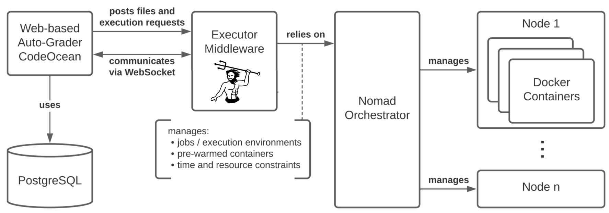

# Poseidon

Poseidon provides containerized execution of arbitrary user code inside a Docker container for learning purposes. It has two main purposes:

1. Securing the executions so that they are isolated from each other and from the host system.
2. Being scalable enough to provide hundreds of executions per minute.
   
Poseidon also offers a live I/O connection to the running program via WebSocket.

Poseidon is designed to be used with [CodeOcean](https://github.com/openHPI/codeocean), a code-execution provider and auto-grader used in MOOC platforms.

Poseidon requires a [Nomad](https://www.nomadproject.io/) cluster for scheduling its executions, which needs to be set up separately.

### Documentation

For the OpenAPI 3.0 definition of the API Poseidon provides, see the [swagger.yaml](api/swagger.yaml).

For the rest of the documentation see the [docs folder](docs). It describes...

- some aspects of the [development workflow](docs/development.md) including setup guide. You should read this first when starting out with the project.
- [configuration](docs/configuration.md) of the system.
- [security configurations](docs/security.md) (how to active access control and TLS with Poseidon).
- [how Poseidon integrates Nomad](docs/nomad_usage.md) in its architecture.
